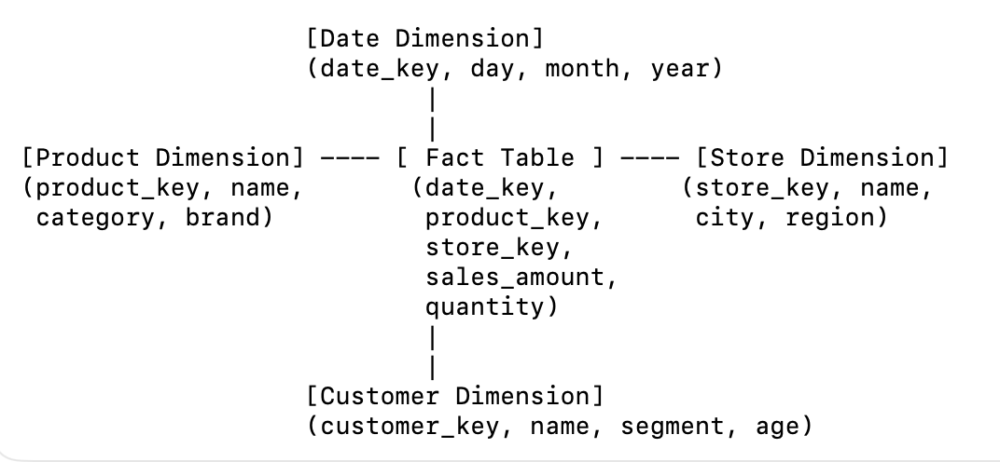
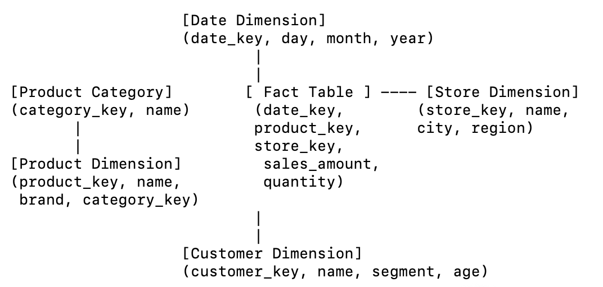
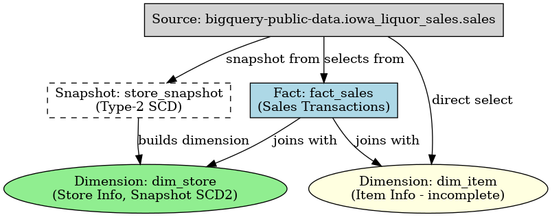

# Lesson

## Brief

### Preparation

Create the conda environment based on the `elt_environment.yml` file. We will also be using google cloud (for which the account was created in the previous unit) in this lesson.

Please refer to the [Environment Folder](https://github.com/su-ntu-ctp/5m-data-2.1-intro-big-data-eng/tree/main/environments) for the environment files.

### Lesson Overview

This lesson introduces data warehouse, ingestion model and dimensional modeling. It also contains hands-on _Transform_ part of ELT (dimensional modeling) with `dbt` and `BigQuery`.

Extract-Load-Transform, often used in near real-time data transactions (OLTP):


Extract-Transform-Load, often used in data analytics (OLAP):


A star schema is the simplest and most common way to organize data in a data warehouse. Think of it like a wheel with spokes:

 •	At the center:

You have a Fact Table → big, fat table that stores the measures/metrics (e.g., sales amount, quantity, revenue) along with foreign keys pointing to dimensions.

	•	Example columns: date_key, product_key, store_key, sales_amount

 	•	Around the edges (the “spokes”):

You have Dimension Tables → descriptive attributes that give context to the facts.

 	•	Example: Product (name, category, brand), Store (location, region), Date (day, month, year).

The schema looks like a ⭐ because the fact table is in the middle, and all dimension tables radiate out from it.

Why use a star schema?

✅ Fast queries – fewer joins, because dimensions are denormalized.

✅ Easy to understand – business users love it; “sales by product by month” is straightforward.

✅ Optimized for OLAP (reporting, dashboards, slicing & dicing).

Drawback

❌ More data redundancy (e.g., if every product row repeats brand info).

❌ Less storage-efficient compared to snowflake schema (where dimensions are normalized).

In short: Star schema = fact table in the middle, dimension tables around it. Simple, fast, business-friendly.

Example of Star Schema:

				   

•	Fact Table (center): stores metrics like sales/revenue/quantity + foreign keys.
•	Dimension Tables (around): give context to those metrics (time, product, store, customer, etc.).

That’s your “star” ⭐—fact in the middle, dimensions radiating out.

Contrast to Snowflake Schema:



Key differences vs. Star Schema:
	•	Normalized dimensions: e.g., Product dimension split into Product + Product Category.
	•	More joins: querying requires joining multiple tables to get full context.
	•	Less redundancy: avoids repeating category info in every product row.
	•	Better data integrity, but can be slightly slower for queries.

In short:

	•	Star: denormalized, simpler, faster queries, more storage.

	•	Snowflake: normalized, smaller storage, more complex queries.

---

## Part 1 - Data Warehouse and Dimensional Modeling

Conceptual knowledge, refer to slides.

---

## Part 2 - Hands-on with dbt and BigQuery



### Designing and Implementing Star Schema and Snowflake Schema for Liquor Sales Data

In this section, we will be using the `liquor_sales` dataset. This dataset contains liquor sales data from Iowa, and available at [BigQuery Public](https://console.cloud.google.com/bigquery?p=bigquery-public-data&d=iowa_liquor_sales&page=dataset). The dbt project is located at `liquor_sales` directory. This is a **fully completed** dbt project that has been pre-populated for you. Skim through the `.yml` and `.sql` files in the `snapshots` and `models` directory.

The source is defined and configured in `models/sources.yml`. It refers to the `bigquery-public-data.iowa_liquor_sales.sales` table.

A star schema with a `sales` fact table, a `store` dimension table and an incomplete `item` dimension table have been implemented. The `schema.yml` files define the schemas for the fact and dimension tables. They contain the name, description and tests for the primary keys of the tables.


#### Snapshots

A snapshot is a table that contains the current state of a source table. Snapshots enable "looking back in time" at previous data states in their mutable tables. While some source data systems are built in a way that makes accessing historical data possible, this is not always the case. Snapshots implement _type-2 Slowly Changing Dimensions_ over mutable source tables. These Slowly Changing Dimensions (or SCDs) identify how a row in a table changes over time.

There is a snapshot for the `store` dimension table defined in `snapshots/store_snapshot.sql`.

#### Models

The `fact_sales` model is defined in `models/fact_sales.sql`. It is a view that selects from the source table.

The dimension models are nested in a `star` subdirectory. Refer to the `dbt_project.yml` file for the configuration. It uses a custom schema and materialized table.

The `dim_store` model is defined in `dim_store.sql`. It selects from the `store_snapshot` table. The `dim_item` model is defined in `dim_item.sql`. Currently it selects from the source table directly.

Build the models with the following command:

```bash
dbt run
```

If you encounter issues with the above, the following commands may help. Run the below before running `dbt run`:

```bash
dbt clean
dbt debug
```

#### Tests

Tests are defined in `schema.yml` files. They are used to validate the data in the tables. For example, the `dim_store` table has a test that checks if the `store_number` is unique and not null.

Run the tests with the following command:

```bash
dbt test
```

Observe the test results. There should be 1 failing test for the `dim_item` table.

#### Practice

> 1. Implement a snapshot for the `item` dimension table. Then update the `dim_item` model to use the snapshot.
> 2. Add a test for the `item_number` foreign key in the `fact_sales` table. The test should check if the `item_number` exists in the `dim_item` table.
> 3. Run the tests again and make sure they pass.


### Designing and Implementing Star Schema for Austin Bikeshare Data

We will be using the `austin_bikeshare` dataset. This data contains the number of hires of bicycles from Austin Bikes. Data includes start and stop timestamps, station names and ride duration.

It is available at [BigQuery Public](https://console.cloud.google.com/bigquery?ws=!1m4!1m3!3m2!1sbigquery-public-data!2saustin_bikeshare).

We will create a dbt project from scratch and implement a star schema for the data warehouse.

1. Run `dbt init austin_bikeshare_demo` to create a new dbt project.
    * Choose `bigquery` as the desired database to use
    * Choose `oauth` as the desired authentication method
    * Enter your GCP project ID when asked
    * Enter `austin_bikeshare_demo` as the name of your dbt dataset
    * For threads and job_execution_timeout_seconds, use the default
    * For desired location, choose US (because the public austin_bikeshare dataset resides in US)

For 2. and 3. below, the learner is advised to go through the liquor_sales DBT project first before returning to complete 2. and 3. below.

2. Add a fact and dimension model.
3. Add tests.


#### Snowflake Schema (Extra)

In a snowflake schema, each dimension can have one or more dimensions. For example, the `item` dimension table can be further normalized into `item`, `category` and `vendor` dimension tables. The `item` dimension table will contain the `category` and `vendor_number` as foreign keys.


For the practices below, create a subdirectory under `models` called `snowflake`.

> 1. Normalize `dim_item` table into `dim_item`, `dim_category` and `dim_vendor` dimension tables.
> 2. Normalize `dim_store` table into `dim_store` and `dim_county` dimension tables.
> 3. Add `schema.yml` with tests for the primary and foreign keys.
> 4. Add a new custom `snowflake` schema with materialized tables in `dbt_project.yml`.
> 5. Run the dbt commands to build the models and run the tests.
